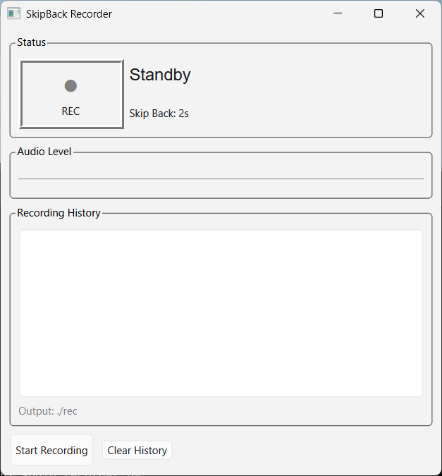

# SkipBackRecorder

A recording application with skip-back feature

> [日本語版ドキュメントはこちら (Japanese)](README_JP.md)

## Overview

SkipBackRecorder is a Windows recording application featuring "skip-back recording" — it can capture audio from **before** you press the record button.

Even if you think "I wish I had been recording that!", you can go back by a configurable number of seconds and include that audio in your recording.

## Features

- **Skip-back recording** - Include audio from a specified number of seconds before pressing record
- **Real-time audio level display** - Monitor input audio levels in real time
- **Simple UI** - Start/stop recording with a single click (button or indicator)
- **Recording history** - View a list of recorded files

## Screenshot



## Requirements

- Windows 10/11
- Python 3.10 or later

## File Structure

```
SkipBackRecorder/
├── main.py           # Main application
├── audio_recorder.py # Audio recording module
├── ui_main.py        # UI module
├── config.py         # Configuration
├── requirements.txt  # Dependencies
├── LICENSE.txt       # MIT License
├── README.md         # English documentation (this file)
├── README_JP.md      # Japanese documentation
├── SETUP.md          # Setup guide
├── screenshot.png    # Screenshot
└── rec/              # Recording output directory (auto-created)
```

## Configuration

You can modify the following settings in `config.py`:

| Setting | Default | Description |
|---------|---------|-------------|
| `SAMPLE_RATE` | 44100 | Sample rate (Hz) |
| `CHANNELS` | 2 | Number of channels (1=Mono, 2=Stereo) |
| `SKIP_BACK_SECONDS` | 2 | Skip-back duration (seconds) |
| `OUTPUT_DIR` | ./rec | Recording output directory |

### Memory Usage Estimates

Estimated memory consumption by skip-back duration:

| Duration | Memory Usage |
|----------|-------------|
| 2s | ~700 KB |
| 5s | ~1.7 MB |
| 10s | ~3.4 MB |
| 30s | ~10 MB |

## Quick Start

```bash
# Install dependencies
pip install -r requirements.txt

# Run
python main.py

# Run without console window (recommended for GUI use)
pythonw main.py
```

For detailed setup instructions, see [SETUP.md](SETUP.md).

## Usage

1. Launch the application
2. Verify audio input using the level meter
3. Click "Start Recording" button or the recording indicator to start recording
4. Click again to stop recording
5. Recorded files are saved in the `rec/` folder

## License

MIT License

Copyright (c) 2026 Masaya Miyazaki / Office Stray Cat

See [LICENSE.txt](LICENSE.txt) for details.

## Author

- **Author:** Masaya Miyazaki
- **Organization:** Office Stray Cat
- **Website:** https://stcat.com/
- **Email:** info@stcat.com
- **GitHub:** https://github.com/stcatcom/SkipBackRecorder

## Support

If you find this project useful, consider supporting development:

[](https://paypal.me/stcatcom?locale.x=ja_JP&country.x=JP)
